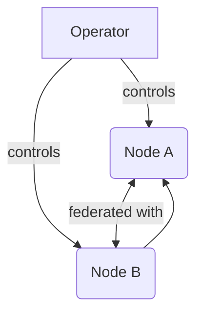

# Proposal 002: Node Authentication

This feature will add **Node Authentication**:

This proposal only considers **identity** in the context of **membership**, not
authorization.

A summary of the authentication pattern is as follows:

* An aurae node is a self-contained runtime environment.
* An operator is an entity that controls an aurae node.
* The aurae node acts as an automated agent for the operator.
* The operator may choose to link the node to an OIDC identity through a
  successful challenge.
* The operator may validate another operator by demonstrating proof that the
  challenge occurred successfully

### Example Use Cases

#### Single Auraed Node
At its simplest, the operator should be able to instantiate auraed without any
federation capabilities. This is useful for small one-off nodes, development,
and air-gapped environments. A set of keys will be generated automatically for
the node, but will not automatically be correlated with any external identity.

#### Multiple Auraed Nodes operated by a Single Entity
The operator may choose to federate multiple nodes under their own control with
each other. Each node must be uniquely identifiable, allowing for cryptographic
control over the membership of the federated nodes. For example, the operator
may choose to add or drop an auraed node.

#### Federated Auraed Nodes operated by a single entity
The operator may choose to federate multiple sets of aurae nodes with each
other. For example, the operator may be the custodian of two or more sets of
nodes.

#### Globally Federated Aurae Nodes
The operator registers themselves with a global identity server, allowing aurae
nodes to mutually identify each other.

### Outcomes

The outcome of this will allow for:
* An operator to authenticate themself to a node.
* A node to authenticate itself to an operator.
* Multiple nodes, controlled by the same operator, to authenticate eachother
  without OIDC federation.
* A node may be registered to an OIDC identity, provable to any observer.
* Multiple OIDC authenticated nodes may mutually authenticate eachother.

The outcome of **feature** will unlock the ability for aurae nodes to interact
with external entities.

### Goals

 - All **technology** will use **decision**.

### Decisions

 - The project will use **specific technology** to solve **specific problem**

### Notes

 - Context and notes

### Authors

 - [@kris-nova](https://github.com/kris-nova)
 - [@Tani](https://github.com/taniwha3)
