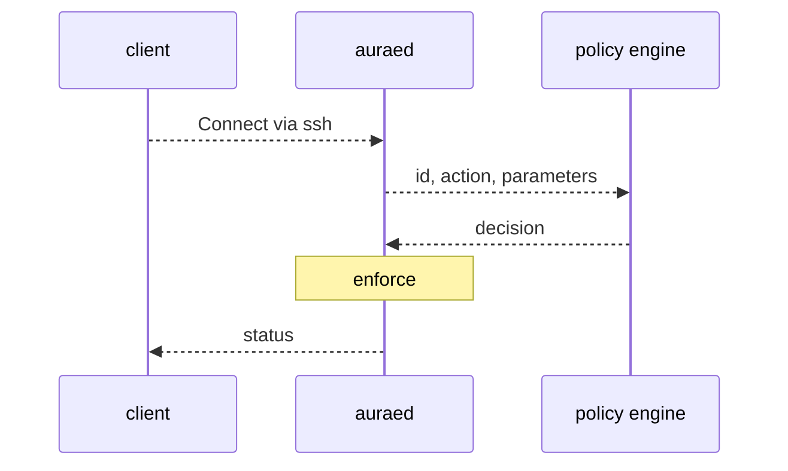

# Design / Feature

This feature will allow an administrative user to authenticate with the node.

#### Scope
This document only covers node authorization. Application authorization is out
of scope for this proposal.

#### Policy Engine
[Proposal 002](/accepted/002.md) provides the aurae daemon with an SSH
authenticated user based upon SSH Certificates. The selected authentication
provides identity and communication channel encryption.

Authorization consumes the identity provided by Proposal 002. When the user
connects, the user identity is authenticated directly from the connection. Upon
initial connection, the identity is sent to an authorization plugin.

The authorization engine receives a message with the identity, action, and
parameters. The authorization engine returns a decision. Aurae Daemon is
responsible for enforcing the decision.

Authorization decisions are sent to the observability module.

A simple default policy engine written in rust will be installed when no other
authorization engine has been installed. Users may choose to implement their
own policy engine by implementing the relevant trait.

Authorization decisions default to deny.

Not installing a policy engine causes all requests to be denied.

#### Default Implement

#### Workflow:

### Outcomes

The outcomes of adding support for policy engines are:

 - auraed will be capable of handling arbitrary scenarios based upon the
  connecting client.
 - policies may be written in languages designed to deal with policy.
 - changes to the policy do not require a recompilation of auraed.
 - policy can be centralized for multiple auraed.

### Goals

 - Aurae Daemon will allow policy engines to be installed.
 - Aurae Daemon will produce a single simple policy plugin.

### Decisions

 - The project will support policy engine plugins.
 - The project will only implement a simple policy plugin in rust.

### Notes

 - The only authorization system that will be implemented in auraed is the
   rust implementation. However, this model allows for other organizations
   to plugin their own authorization modules to support their own patterns.
   See [Zanzibar: Google’s Consistent, Global Authorization System](https://research.google/pubs/pub48190/)
   for an example.

### Authors

 - [@kris-nova](https://github.com/kris-nova)
 - [@tani](https://github.com/taniwha3)
